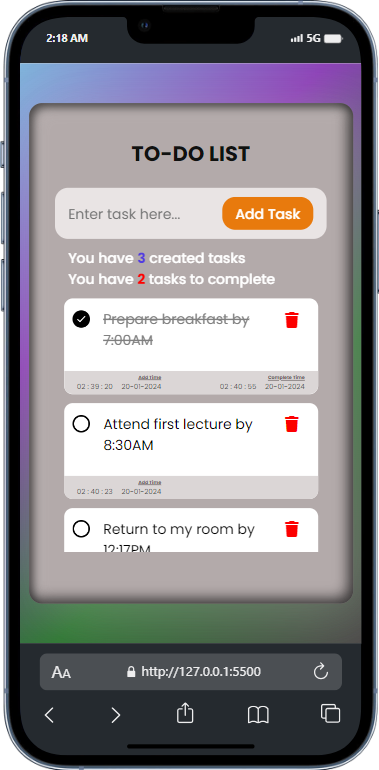

# Todo List App with Timestamps

## Overview

This is a simple and feature-rich to-do list application that allows users to manage their tasks efficiently. The app provides a clean and intuitive user interface for creating, updating, and deleting tasks. One standout feature is the automatic timestamping of each task, providing a clear timeline of task creation and completion.

## Features

- **Task Management:** Add, update, and remove tasks easily.
- **Timestamps:** Each task comes with a timestamp indicating when it was created and completed.
- **Task Counters:** Keep track of the total number of created and pending tasks.
- **Responsive Design:** Enjoy a seamless experience across different devices.

## Usage

1. Clone the repository: `git clone https://github.com/yusufolanrewaju/to-do_List.git`
2. Open `index.html` in your preferred web browser.
3. Start adding, updating, and completing tasks!

## How to Contribute

If you'd like to contribute to this project, follow these steps:

1. Fork the repository.
2. Create a new branch for your feature or bug fix.
3. Make your changes and submit a pull request.

## Technologies Used

- HTML
- CSS
- JavaScript

## Acknowledgments

- [FontAwesome](https://fontawesome.com/) for the task delete icon.
- [UXWing](https://uxwing.com/) for the app icon, mark icon and unchecked icon.
- [YouTube]I tapped some ideas from OnlineTutorial, Mitali Jadhavrao and Abi Nas.
- [Mr.Vincent] for inspiration.

## License

This project is licensed under the [MIT License](LICENSE).

